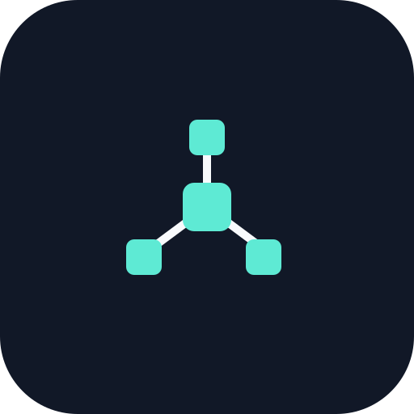

<p align="center">
  
</p>

---

<p align="center">
  
</p>

<p align="center">
  
</p>

---

## 👨‍💻 About Me

```java
public class Nagaraj_Hegde {

    String role =
        "Java Backend Engineer";

    String education =
       "Pursuing Higher Education @ Bangalore Institute of Technology";

    String focus =
        "Building scalable, reliable, and high-performance backend systems "
        + "using Java, Spring Boot, Microservices, Kafka, Redis, Docker, and AWS, "
        + "while integrating AI capabilities such as Generative AI, LLMs, RAG, and Spring AI "
        + "into real-world applications";

    String strengths =
        "DSA, Problem Solving, OOP, and System Design";

    String exploring =
        "Generative AI, LLMs, RAG, Spring AI, LangChain, LangGraph, and Agentic AI";

    String goal =
        "Build my career as a Java Backend Engineer focused on developing AI-powered applications";
}
```
<br/>

---

### Backend Technologies 💻

<table>
  <tr>
    <td align="center" width="190">
      
    </td>
    <td align="center" width="190">
      
    </td>
    <td align="center" width="190">
      
    </td>
    <td align="center" width="190">
      
    </td>
    <td align="center" width="190">
      
    </td>
    <td align="center" width="190">
      
    </td>
    <td align="center" width="190">
      
    </td>
  </tr>

  <tr>
    <td align="center" width="190">
      
    </td>
    <td align="center" width="190">
      
    </td>
    <td align="center" width="190">
      
    </td>
    <td align="center" width="190">
      
    </td>
    <td align="center" width="190">
    
    </td>
    <td align="center" width="190">
      
    </td>
    <td align="center" width="190">
      
    </td>
  </tr>

  <tr>
    <td align="center" width="190">
      
    </td>
    <td align="center" width="190">
      
    </td>
    <td align="center" width="190">
      
    </td>
    <td align="center" width="190">
      
    </td>
    <td align="center" width="190">
      
    </td>
    <td align="center" width="190">
      
    </td>
    <td align="center" width="190">
      
    </td>
  </tr>
</table>

---

### AI Technologies 🤖

<p align="left">

  

  

  

  

  

  

  

  

</p>

---

## 🚀 My Projects

<p align="left">

  <a href="https://github.com/nagarajhegde174-beep/AI-Chatbot">
    
  </a>

  <a href="https://github.com/nagarajhegde174-beep/URL-Shortner">
    
  </a>

  <a href="https://github.com/nagarajhegde174-beep/Jpmorgan-transaction-engine">
    
  </a>

  <a href="https://github.com/nagarajhegde174-beep/Walmart-data-structures-pipeline">
    
  </a>

  <a href="https://github.com/nagarajhegde174-beep/Wells-fargo-advisor-portal">
    
  </a>

  <a href="https://github.com/nagarajhegde174-beep/HPE-employee-management-api">
    
  </a>

</p>

<p align="left">
  <a href="https://github.com/nagarajhegde174-beep?tab=repositories">
    
  </a>
</p>

---

## 📊 GitHub Stats

<div align="center">

<a href="https://github.com/nagarajhegde174-beep">


---


</a>

</div>

---

## 🏗️ Contributions (3D View)
<p align="center">
  
</p>

---

<h2 align="left">🤝 Connect With Me</h2>
<table width="240" align="center">
<tr>
<td align="center" width="60">
<a href="https://www.linkedin.com/in/nagaraj-hegde-25bbb2382">

</a>
</td>
<td align="center" width="60">
<a href="https://x.com/NagarajHeg54130">

</a>
</td>
<td align="center" width="60">
<a href="mailto:nagarajhegde174@gmail.com">

</a>
</td>
<td align="center" width="60">

</td>
</tr>
</table>

---

<p align="center">
  
</p>

<div align="center">
  
🔥 Building something ambitious? Let's collaborate


[](mailto:nagarajhegde174@gmail.com)
[](https://www.linkedin.com/in/nagaraj-hegde-25bbb2382)

</div>

---

<p align="center">
  
</p>
